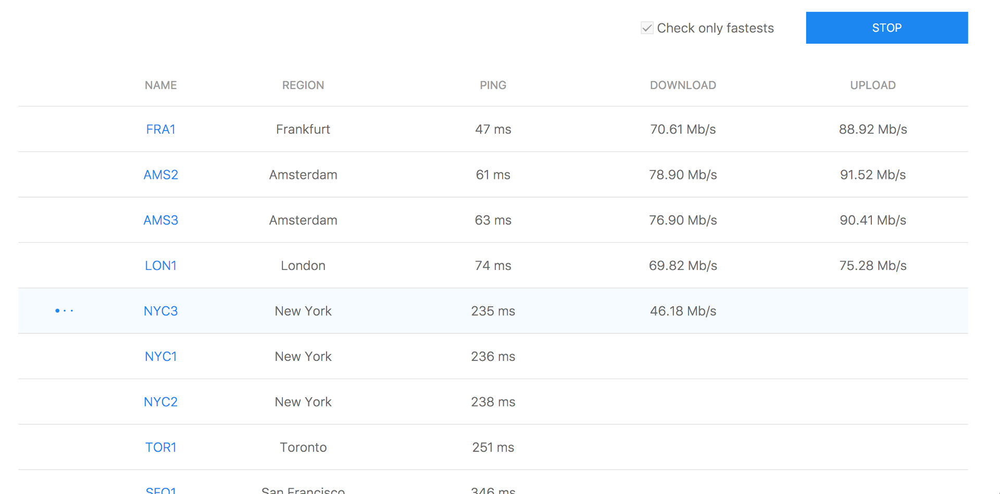

Speed Test for DigitalOcean
===========================

DigitalOcean provides usefull links to run speed tests for each datacenter, but only one at a time.
I created this repository to speed up this process.

Run speed tests for all DigitalOcean datacenters faster than ever.

[http://speedtest-do.marcomontalbano.com](http://speedtest-do.marcomontalbano.com)

Just click start!

This tool uses the same service used by _speedtest-*.digitalocean.com_ so the result should be the same.

## Need an account for DigitalOcean?

Click [here](https://m.do.co/c/45b8cffe90f8) to register a new one!

